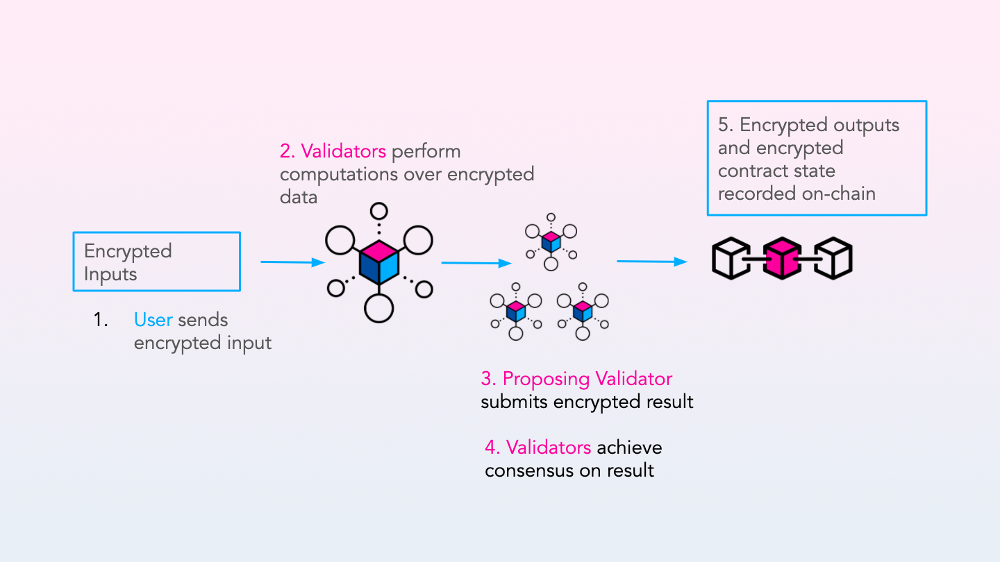

# General Overview

Secret Network is a blockchain protocol that enables decentralized applications to perform encrypted computations. The Rust code that enables applications to use private data is referred to as a “Secret Contract” on Secret Network. Secret Contracts are similar to smart contracts, such as those used with Ethereum. The key difference is that Secret Contracts can take encrypted inputs and produce encrypted outputs, without exposing any data while it is in-use. In addition, a contract state (its internal, persisted database), remains encrypted throughout executions.

Data on blockchains is public by default. This is a problem for applications which make use of sensitive information, such as user data, personally identifiable information (PII), votes, or moves in a game like rock-paper-scissors or poker. The Secret Network aims to solve this problem by enabling data-in-use privacy through private computation for decentralized applications.

For example, a developer could create a voting application where individual votes are never revealed, but the overall results are provably correct. Additionally, a credit scoring application could generate a score based on verified data submitted by users, without ever seeing that sensitive data (or storing it on-chain). Many applications require data privacy, which is especially difficult to achieve in blockchain-based applications.

The Secret Network is decentralized, so governance decisions are made collectively through votes conducted by the community. The network is run by delegators and validators who propose blocks according to a delegated proof-of-stake model. Node operators earn SCRT rewards for proposing new blocks. Users pay SCRT to the network as fees in order to have their transactions included.

The Secret Network was built with the Cosmos SDK using Tendermint for consensus. Enigma is a company introducing a privacy-preserving applications and ecrypted computation services. As part of this work, Enigma is a core contributor to the Secret Network.

To achieve data privacy, the Secret Network relies on a combination of key management and encryption protocols, along with Trusted Execution Environment (TEE) technology.

